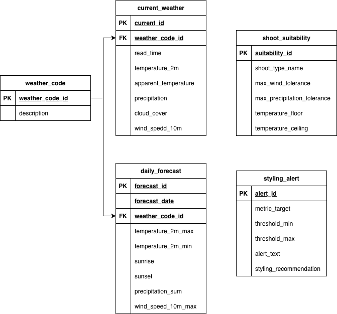

# Database Schema Documentation

## San Diego Weather Helper for Photographers Data Warehouse

This database stores structured current weather observations, multi-day meteorological forecast data, and rule-based photography execution models loaded into a local PostgreSQL database instance.

The schema is normalized to approximately Third Normal Form (3NF) by:

- separating entities into related tables
- avoiding repeated data
- using bridge tables for many-to-many relationships

--

### ER Diagram

## Database Overview

The database contains 5 tables

- 'weather_code'
- 'current_weather'
- 'daily_forecast'
- 'shoot_suitability'
- 'styling_alert'

### Entity Relationship Summary

| Table | Purpose |
| --- | --- |
| `weather_code` | Stores standardized WMO weather condition codes and descriptions |
| `current_weather` | Stores hourly active-level atmospheric metrics capturing immediate execution states |
| `daily_forecast` | Stores 16-day upcoming predictive aggregated daily weather timelines |
| `shoot_suitability` | Reference table defining structural limits and locations for specific shoot types |
| `styling_alert` | Reference table containing hair and makeup styling recommendations mapped to atmospheric boundaries |

--

## Table Documentation

### 1. 'weather_code'

**Purpose**

Stores standardized WMO (World Meteorological Organization) weather interpretation codes and their descriptions.

**Example**

- Code `0` = Clear sky
- Code `61` = Rain: Slight intensity

**Primary Key**

- `weather_code_id`

**Relationships**

- One `weather_code` can relate to many `weather_forecast` records.
- Referenced by `weather_forecast.weather_code_id`.

**Table Structure**

| Column Name | Data Type | Key | Description |
| --- | --- | --- | --- |
| `weather_code_id` | `INTEGER` | Primary Key | Unique WMO weather condition code |
| `description` | `TEXT` |  | Description of the weather condition |

---

### 2. `current_weather`

**Purpose**

Stores continuous hourly active meteorological parameters parsed directly from the API endpoint payloads to drive immediate dashboard alerts

**Primary Key**
- `current_id`

**Foreign Keys**
- `weather_code_id` → `weather_code.weather_code_id`

**Table Structure**

| Column Name | Data Type | Key | Description |
| --- | --- | --- | --- |
| `current_id` | `SERIAL` | Primary Key | Auto-incrementing unique internal observation record ID. |
| `read_time` | `TIMESTAMP` |  | The specific date and hour of the recorded weather window state. |
| `temperature_2m` | `DOUBLE PRECISION` |  | Ambient air temperature measured 2 meters above ground |
| `relative_humidity_2m` | `INTEGER` |  | Relative humidity percentage value |
| `apparent_temperature` | `DOUBLE PRECISION` |  | Calculated apparent "feels-like" thermal tracking temperature |
| `precipitation` | `DOUBLE PRECISION` |  | Instantaneous hourly precipitation depth total |
| `weather_code_id` | `INTEGER` | Foreign Key | Active structural condition indicator code |
| `cloud_cover` | `INTEGER` |  | Total percentage of cloud cover determining ambient light quality |
| `wind_speed_10m` | `DOUBLE PRECISION` |  | Velocity of ambient wind vectors at a height of 10 meters |

---

### 3. `daily_forecast`

**Purpose**

Stores extended time-series aggregated daily weather prediction variables to drive chronological calendar scheduling visuals

**Primary Key**
- `forecast_id`

**Foreign Keys**
- `weather_code_id` → `weather_code.weather_code_id`

**Table Structure**

| Column Name | Data Type | Key | Description |
| --- | --- | --- | --- |
| `forecast_id` | `BIGSERIAL` | Primary Key | Auto-generated transactional forecast line key. |
| `forecast_date` | `DATE` | Unique | Calendar date of the target predictive forecast record |
| `weather_code_id` | `INTEGER` | Foreign Key | Dominant daily structural WMO condition code constraint |
| `temperature_2m_max` | `DOUBLE PRECISION` |  | Maximum predicted daily daytime temperature |
| `temperature_2m_min` | `DOUBLE PRECISION` |  | Minimum predicted daily nighttime temperature |
| `sunrise` | `TIMESTAMP` |  | Exact daily calculated sunrise timeline event |
| `sunset` | `TIMESTAMP` |  | Exact daily calculated sunset timeline event |
| `precipitation_sum` | `DOUBLE PRECISION` |  | Cumulative expected aggregate daily precipitation |
| `wind_speed_10m_max` | `DOUBLE PRECISION` |  | Maximum daily predicted peak wind speed vector threshold |

---

### 4. `shoot_suitability`

**Purpose**

A business rules lookup table containing environmental parameters and thresholds that classify whether a target venue or shoot style is recommended

**Example**
- `Beach Portrait`: Max Wind `< 12 mph`, Precipitation `= 0%`
- `Indoor Studio`: Recommended if Precipitation `> 60%` OR Temp `> 85°F`

**Primary Key**
- `suitability_id`

**Table Structure**

| Column Name | Data Type | Key | Description |
| --- | --- | --- | --- |
| `suitability_id` | `INTEGER` | Primary Key | Unique identifier for the booking configuration constraint. |
| `shoot_type_name` | `VARCHAR(50)` | Unique | Descriptive name of the booking environment (e.g., 'Beach Portrait', 'Indoor Studio') |
| `max_wind_tolerance` | `DOUBLE PRECISION` |  | Maximum acceptable wind threshold in mph allowed for this session style |
| `max_precipitation_tolerance` | `DOUBLE PRECISION` |  | Maximum precipitation boundary allowed before cancellation/relocation |
| `temperature_floor` | `DOUBLE PRECISION` |  | Minimum temperature baseline before suggesting indoor staging options. |
| `temperature_ceiling` | `DOUBLE PRECISION` |  | Maximum temperature baseline before directing sessions indoors |

---

### 5. `styling_alert`

**Purpose**

A specialized lookup dictionary that correlates humidity thresholds and wind speed ranges directly to actionable hair prep, cosmetic rules, and wardrobe safety instructions

**Primary Key**
- `alert_id`

**Table Structure**

| Column Name | Data Type | Key | Description |
| --- | --- | --- | --- |
| `alert_id` | `INTEGER` | Primary Key | Unique constraint identifier for the cosmetic alert condition. |
| `metric_target` | `VARCHAR(30)` |  | Identifies the atmospheric metric being tracked (e.g., 'humidity', 'wind') |
| `threshold_min` | `DOUBLE PRECISION` |  | The inclusive lower boundary value that activates this warning state |
| `threshold_max` | `DOUBLE PRECISION` |  | The upper boundary value that deactivates this warning state. |
| `alert_text` | `TEXT` |  | Actionable message dispatched to clients (e.g., 'High frizz risk. Advise water-resistant makeup.') |
| `styling_recommendation` | `TEXT` |  | Concrete technical style advice (e.g., 'Secure loose hair; avoid long flowing veils.' |

---

## Cardinality Relationships

| Parent Table | Child Table | Relationship Type |
| --- | --- | --- |
| `weather_code` | `current_weather` | One-to-Many (`1:N`) |
| `weather_code` | `daily_forecast` | One-to-Many (`1:N`) |

---

## Normalization Notes (3NF)

This schema achieves full compliance with Third Normal Form (3NF) database principles:
- **Elimination of Multi-Value Text Blobs:** Separates contextual recommendations (like styling alerts and wind thresholds) away from transactional logs, removing repetitive message text bloat
- **Strict Attribute Dependency:** Non-key columns depend explicitly and solely on each table's designated unique primary key constraint
- **Functional Isolation:** Separates active execution data (`current_weather`) entirely from structural scheduling baselines (`daily_forecast`), eliminating transactional table update anomalies

---

## Data Sources

### Weather Data Source

Weather forecast data is sourced from the Open-Meteo API.

The API provides:

- daily forecasts
- weather condition codes
- precipitation data
- temperature data
- UV index data
- sunrise and sunset times

Weather condition codes follow WMO Weather Interpretation standards.

### Business Intelligence Logic Source

Photography recommendations, location constraints, and styling warning thresholds are constructed explicitly from CSV files containing:

- hair and makeup information
- photoshoot classifications